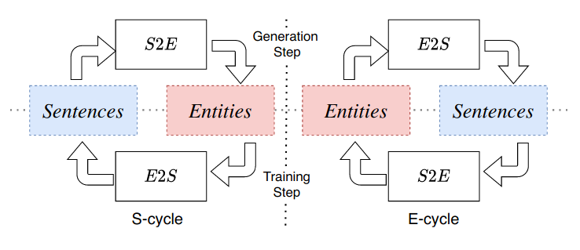

# CycleNER

This is a project implementing an [Original Paper](https://dl.acm.org/doi/10.1145/3485447.3512012) by Andrea Iovine, Anjie Fang, Besnik Fetahu, Oleg Rokhlenko, Shervin Malmasi.

CycleNER uses cycle-consistency training for two functions: sequence-to-entity (S2E); and entity-to-sequence (E2S), to learn NER tags from some seed set of sentences and another set of entity examples. The output from one function is the input the the other and the algorithm attempts to align each representation space, thus, learning to tag named entities in an unsupervised manner.



## How to Use
---

### Preparation

To train the model, a pipeline has been implemented based on the huggingface API (not exactly compliant but similar). A preparation script is provided to load data from jsons, stored in the correct format, into datasets which can be used by the model during training.

All data, stored in json format, must be of the form:
```json
{
    "sents": ["sent 1", "sent 2"],
    "ent_seqs": ["ent | seq | ent1 | seq1", ""]
}
```

A script has been provided for experiments using the CoNLL2003 dataset called `format_conll_data.py`. Using the provided parameters, differing quantities of samples can be used for the S2E training set and E2S training set. An example command is provided here:
```
python format_conll_data.py --s_examples 10000 --e_examples 1000
``` 

For a full set of options, use:
```
python format_conll_data.py --help
```


There are 3 classes of data in this model: `train`, `eval`, and `test`. Training doe not require a bijective mapping of sentences to entity sequences as the goal of the model is to align the feature spaces of the two non-parallel datasets. However, as outlined in the original paper, there should be some overlap between the entities used in sentences and in entity sequences. Below is a table outlining the requirements for each dataset:
| **Dataset** | **Bijective** |
|-------------|:-------------:|
| train       | no            |
| eval        | yes           |
| test        | yes           |

An example command is provided for preparing data. Please note that file locations will likely differ:
```
python prepare.py --model_name test_model --model_dir ./models --train_dir ./data/train --eval_dir ./data/eval --test_dir ./data/test
```

For a full set of options, use:
```
python prepare.py --help
```

Once the model has been prepared, all required files for training will be stored in the models directory under the specified file name

---

### Training

The iterative training stage performs the cycle-consistency training outlined above. The model iterates between S- and E- cycles until all of one of the datasets is complete. Only cycles for the remaining data are then used until all data from both sets are consumed, at which point the epoch is complete. At each epoch, the model is evaluated against the evaluation set for S2E loss, E2S loss and S2E-f1. The training stage (if you really want?) can be skipped.

An example training command is provided here:
```
python train.py --model_dir ./models/test_model --output_dir ./checkpoints/test_model --batch_size 64 --s2e_lr 3e-4 --e2s_lr 3e-4
```

For a full list of options, use:
```
python train.py --help
```

---

### Inference

To use the model for NER tagging, the generation script can be used. This will take a sentence in and produce a tagged entity sequence out. An example generation command is provided here:
```
python generate.py --model_dir ./models/test_model --input "The man from Germany went to London to work for Google with his wife Henreitta."
```

---

### Training Inspection

Checkpoints for training are stored, by default, in the model folder but the output directory can be changed. SummaryWriter is used to log the progress of training for a number of different variables - the outputs of which can be explored in `extract_runs_data.ipynb`. Alternatively, tensorboard can be used with the command:
```
tensorboard --logdir ./runs
```

---

## Parameter Searching

To search for the best training parameters, `train_grid_search.sh` has been provided to iterate over different permutations of parameters. Update the parameters in the script's arrays for search over that space. The script can be run with:
```
chmod +x train_grid_search.sh
./train_grid_search.sh
```